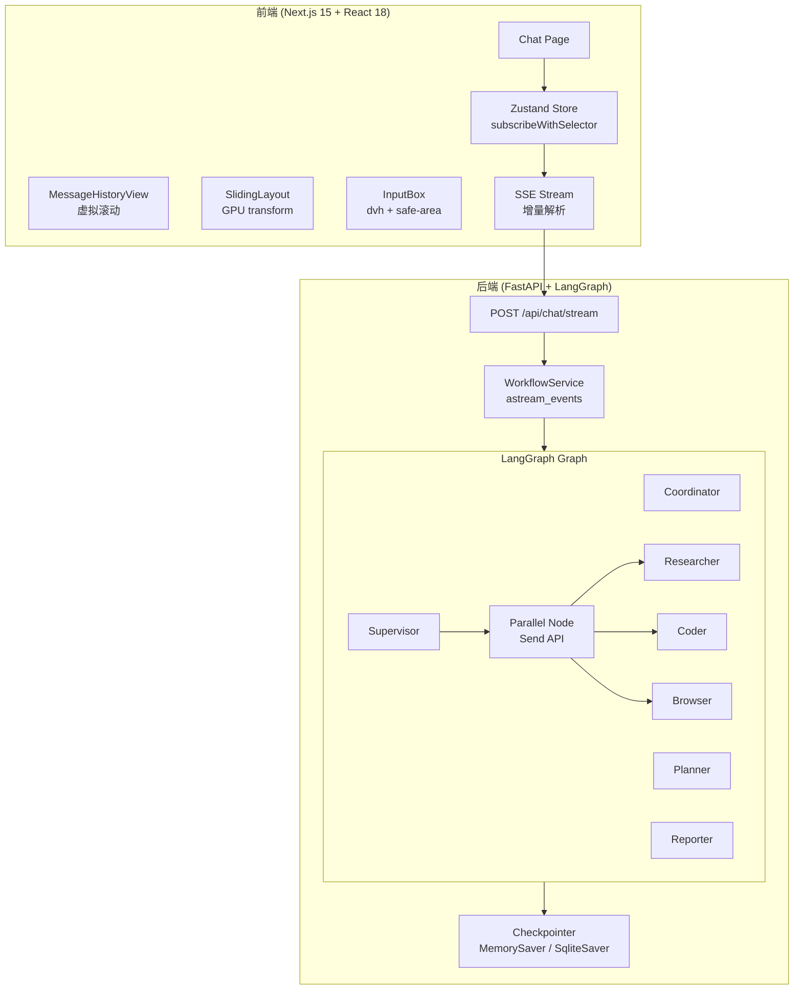
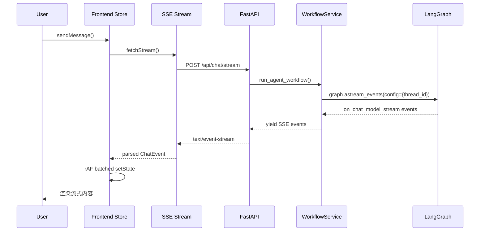

# Design Document: Frontend & Agent Refactor

## Overview

本设计文档描述 FreeTop 平台的全面重构方案，涵盖三个核心方向：

1. **前端响应性优化** — 虚拟滚动、SlidingLayout GPU 动画修复、移动端触摸体验、Zustand 状态批量更新
2. **智能体框架升级** — LangGraph Checkpointing、Supervisor 路由优化、并行执行支持、Token 流式输出
3. **测试架构完善** — 前端 Vitest 单元测试、后端 pytest-asyncio 集成测试

### 当前问题诊断

**前端**
- `SlidingLayout` 在渲染期间直接读取 `window.innerWidth`，导致 SSR hydration 不一致
- `MessageHistoryView` 渲染全量消息节点，消息多时 DOM 膨胀
- `wheel` 事件监听器在每次 `useEffect` 重新执行时可能重复注册
- Zustand store 未使用 `subscribeWithSelector`，导致全量订阅触发不必要的重渲染
- 流式 token 更新直接调用 `setState`，未经 `requestAnimationFrame` 批处理

**后端**
- `build_graph()` 未注入 checkpointer，无法持久化会话状态
- `supervisor_node` 的 `repeat_count` 逻辑已部分实现但阈值为 2，需调整为 3
- 无并行执行支持，独立子任务串行执行效率低
- 协调器 token 过滤逻辑依赖缓存计数，存在边界情况

---

## Architecture

### 整体架构图



### 数据流



---

## Components and Interfaces

### 前端组件

#### MessageHistoryView（虚拟滚动重构）

```typescript
interface VirtualScrollConfig {
  itemHeight: number;        // 估算行高，默认 80px
  overscan: number;          // 视口外预渲染条数，默认 5
  containerHeight: number;   // 滚动容器高度
}

interface MessageHistoryViewProps {
  messages: Message[];
  responding: boolean;
  abortController?: AbortController;
  className?: string;
}
```

虚拟滚动实现策略：
- 使用 `useVirtualizer`（来自 `@tanstack/react-virtual`）或自实现简单虚拟列表
- 单一滚动容器，`overflow-y: auto`，消除嵌套滚动上下文
- `IntersectionObserver` 检测底部元素可见性，替代 scroll 事件轮询
- `wheel` 事件监听器通过 `useEffect` 依赖数组精确控制，确保每个容器实例只注册一次

#### SlidingLayout（SSR 安全修复）

```typescript
interface SlidingLayoutProps {
  children: ReactNode;
  sidePanel?: ReactNode;
  isOpen: boolean;
  onClose: () => void;
  panelWidth?: string;  // 新增，默认 "min(600px, 80vw)"（CSS 值）
}
```

关键修复：
- 移除所有 `window.innerWidth` 直接读取，改用 CSS `clamp()` / `min()` 函数
- `transform: translateX` 动画在 GPU compositor layer 执行（`will-change: transform` 仅在动画期间设置）
- 面板关闭后通过 `onTransitionEnd` 回调卸载 DOM 节点
- 过渡期间对主内容和面板均设置 `pointer-events: none`

#### Zustand Store（subscribeWithSelector 升级）

```typescript
// 新增中间件
import { subscribeWithSelector } from 'zustand/middleware';

const useStore = create<Store>()(
  subscribeWithSelector((set, get) => ({
    messages: [],
    responding: false,
    currentTaskId: null,
  }))
);

// 组件订阅特定切片
const responding = useStore(state => state.responding);
const messages = useStore(state => state.messages);
```

#### SSE Stream（增量解析）

`fetchStream` 已使用 `TextDecoderStream` 增量解析，保持现有实现，补充以下改进：
- 确保 `task_started` 事件的 `taskId` 正确传播到所有后续事件
- 在 `AbortSignal` 触发时立即释放 reader lock

### 后端组件

#### build_graph()（Checkpointing 注入）

```python
from langgraph.checkpoint.memory import MemorySaver

def build_graph(checkpointer=None):
    if checkpointer is None:
        checkpointer = MemorySaver()
    builder = StateGraph(State)
    # ... 添加节点和边 ...
    return builder.compile(checkpointer=checkpointer)
```

#### State（thread_id 扩展）

```python
class State(MessagesState):
    TEAM_MEMBERS: list[str]
    TEAM_MEMBER_CONFIGRATIONS: dict[str, dict]
    next: str
    full_plan: str
    deep_thinking_mode: bool
    search_before_planning: bool
    thread_id: str          # 新增：每个用户会话的唯一标识
    repeat_count: int       # 已存在，确保初始值为 0
    parallel_tasks: list    # 新增：并行任务列表
    user_id: Optional[int]  # 已存在
```

#### parallel_node（LangGraph Send API）

```python
from langgraph.types import Send

def parallel_dispatch_node(state: State):
    """根据 planner 输出的 parallel_tasks 分发并行任务"""
    tasks = state.get("parallel_tasks", [])
    return [Send(task["agent"], {**state, "current_task": task}) for task in tasks]

def parallel_merge_node(state: State):
    """合并所有并行任务结果"""
    # 收集所有并行结果消息，合并为单条 HumanMessage
    parallel_results = state.get("parallel_results", [])
    merged = "\n\n---\n\n".join(
        f"[{r['agent']}]: {r['content']}" for r in parallel_results
    )
    return Command(
        update={"messages": [HumanMessage(content=merged, name="parallel_merge")]},
        goto="supervisor"
    )
```

#### WorkflowService（thread_id 传递）

```python
async def run_agent_workflow(
    user_input_messages: list,
    thread_id: Optional[str] = None,
    # ... 其他参数 ...
):
    if thread_id is None:
        thread_id = str(uuid.uuid4())
    
    config = {
        "configurable": {"thread_id": thread_id},
        "recursion_limit": 50,
    }
    
    async for event in graph.astream_events(
        {...},
        version="v2",
        config=config,
    ):
        # ... 事件处理 ...
```

---

## Data Models

### 前端消息类型（无变化，确认现有定义）

```typescript
// web/src/core/types/message.ts
interface TextMessage {
  id: string;
  role: "user" | "assistant";
  type: "text";
  content: string;
  agent_name?: string;  // 新增：来源智能体名称
}

interface WorkflowMessage {
  id: string;
  role: "assistant";
  type: "workflow";
  content: { workflow: Workflow };
}

type Message = TextMessage | WorkflowMessage;
```

### SSE 事件类型（新增字段）

```typescript
// 现有 message 事件新增 agent_name
interface MessageEvent {
  type: "message";
  data: {
    message_id: string;
    delta: { content?: string; reasoning_content?: string };
    agent_name: string;  // 新增必填字段
  };
}

// 新增并行执行事件
interface ParallelStartEvent {
  type: "parallel_start";
  data: { workflow_id: string; tasks: string[] };
}

interface ParallelEndEvent {
  type: "parallel_end";
  data: { workflow_id: string; results_count: number };
}
```

### 后端 State 扩展

```python
class State(MessagesState):
    # 常量
    TEAM_MEMBERS: list[str]
    TEAM_MEMBER_CONFIGRATIONS: dict[str, dict]
    # 运行时变量
    next: str
    full_plan: str
    deep_thinking_mode: bool
    search_before_planning: bool
    thread_id: str
    repeat_count: int
    parallel_tasks: list[dict]   # [{agent, task, dependencies}]
    parallel_results: list[dict] # [{agent, content}]
    user_id: Optional[int]
```

### Planner JSON 输出格式（扩展）

```json
{
  "steps": [...],
  "parallel_tasks": [
    {
      "agent": "researcher",
      "task": "搜索相关资料",
      "dependencies": []
    },
    {
      "agent": "coder",
      "task": "生成代码框架",
      "dependencies": []
    }
  ]
}
```

---

## Correctness Properties

*A property is a characteristic or behavior that should hold true across all valid executions of a system — essentially, a formal statement about what the system should do. Properties serve as the bridge between human-readable specifications and machine-verifiable correctness guarantees.*

### Property 1: 虚拟滚动 DOM 节点数量上限

*For any* message list with more than 50 messages, the number of rendered DOM nodes in `MessageHistoryView` should remain below 30 at any given scroll position.

**Validates: Requirements 1.1**

---

### Property 2: 单一滚动容器不变量

*For any* rendered `MessageHistoryView` instance, there should be exactly one element in the component tree with `overflow-y` set to `scroll` or `auto`.

**Validates: Requirements 1.5**

---

### Property 3: rAF 批处理更新频率

*For any* sequence of N streaming token events arriving within a single animation frame, the Zustand store's `setState` should be called at most once per animation frame per message, regardless of N.

**Validates: Requirements 4.1**

---

### Property 4: React.memo 精确重渲染

*For any* `MessageView` component instance, if only fields other than `message.content` and `message.id` change (e.g., metadata fields), the component should not re-render.

**Validates: Requirements 4.2**

---

### Property 5: 结构共享不变量

*For any* workflow message update in the store, all other message objects in the `messages` array should remain reference-equal to their previous values (no unnecessary cloning).

**Validates: Requirements 4.5**

---

### Property 6: Supervisor 路由重复计数与终止

*For any* sequence of supervisor routing decisions where the same agent is selected consecutively, `repeat_count` should increment by 1 on each repeat, routing should switch to `planner` after the first repeat, and the workflow should terminate (`goto="__end__"`) when `repeat_count` reaches 3.

**Validates: Requirements 6.2, 6.3**

---

### Property 7: Supervisor 无效路由拒绝

*For any* LLM response that contains an agent name not present in `TEAM_MEMBERS + ["FINISH"]`, the `supervisor_node` should raise a `ValueError` rather than silently routing to an invalid destination.

**Validates: Requirements 6.1**

---

### Property 8: 并行任务结果合并完整性

*For any* set of N parallel agent tasks that complete successfully, the merged `HumanMessage` in State should contain exactly N result segments, one from each agent.

**Validates: Requirements 7.2**

---

### Property 9: 并行任务失败隔离

*For any* set of parallel tasks where one or more fail, the remaining tasks should complete normally, and the merged result should include both successful results and error descriptions for failed tasks.

**Validates: Requirements 7.4**

---

### Property 10: 协调器 Token 过滤

*For any* coordinator node response that contains the string `"handoff_to_planner"`, zero coordinator token events should appear in the SSE stream yielded to the frontend.

**Validates: Requirements 8.3**

---

### Property 11: SSE message 事件包含 agent_name

*For any* `message` SSE event emitted by `WorkflowService`, the event data should contain a non-empty `agent_name` field identifying the source agent.

**Validates: Requirements 8.4**

---

### Property 12: Planner 无效 JSON 终止

*For any* LLM response to the planner that is not valid JSON (after repair attempts), `planner_node` should return `goto="__end__"` rather than proceeding to the supervisor.

**Validates: Requirements 10.2**

---

## Error Handling

### 前端错误处理

| 场景 | 处理策略 |
|------|----------|
| SSE 连接断开 | `fetchStream` 捕获 `AbortError`，静默退出；其他错误向上抛出 |
| JSON 解析失败 | `parseEvent` 返回 `undefined`，跳过该事件 |
| 虚拟滚动容器未挂载 | `useEffect` 中检查 ref，延迟初始化 |
| `window` 未定义（SSR） | `SlidingLayout` 所有 `window.*` 访问移入 `useEffect` |
| Store 更新竞态 | `rAF` 队列确保同一帧内只有最后一次更新生效 |

### 后端错误处理

| 场景 | 处理策略 |
|------|----------|
| LLM 返回无效 JSON | `planner_node` 使用 `json_repair` 尝试修复，失败则 `goto="__end__"` |
| Supervisor 路由无效 | 抛出 `ValueError`，由 LangGraph 捕获并终止该节点 |
| 并行子任务异常 | `try/except` 捕获，将错误信息写入 `parallel_results`，不中断其他任务 |
| Checkpointer 写入失败 | 记录 WARNING 日志，降级为无状态执行（不影响当前请求） |
| SSE 客户端断开 | `req.is_disconnected()` 检测，设置 `abort_event`，LangGraph 在下一个 checkpoint 停止 |
| `graph.update_state()` 失败 | 记录 ERROR 日志，不向客户端暴露内部错误 |

### 错误边界设计

```
WorkflowService.run_agent_workflow()
  └── try/except asyncio.CancelledError → 清理浏览器工具，re-raise
  └── try/except Exception → 记录日志，yield error message event，return
  └── finally → 清理 browser_tool, smart_browser_tool

parallel_merge_node()
  └── 每个并行任务独立 try/except
  └── 失败任务写入 {"agent": name, "content": f"ERROR: {e}", "error": True}
```

---

## Testing Strategy

### 双轨测试方法

本项目采用**单元测试 + 属性测试**双轨策略：
- **单元测试**：验证具体示例、边界条件、错误路径
- **属性测试**：验证对所有输入均成立的普遍性质

两者互补，共同保证系统正确性。

---

### 前端测试（Vitest）

**测试框架配置**

```typescript
// web/vitest.config.ts
import { defineConfig } from 'vitest/config';
import react from '@vitejs/plugin-react';

export default defineConfig({
  plugins: [react()],
  test: {
    environment: 'jsdom',
    globals: true,
    setupFiles: ['./src/test/setup.ts'],
  },
});
```

**依赖安装**

```bash
pnpm add -D vitest @vitejs/plugin-react @testing-library/react @testing-library/user-event jsdom
# 属性测试库
pnpm add -D fast-check
```

**单元测试用例**

```
web/src/app/_components/__tests__/
  MessageHistoryView.test.tsx   # 自动滚动、滚动锁定、按钮显示
  SlidingLayout.test.tsx        # 面板开关、SSR 安全、pointer-events
  InputBox.test.tsx             # 键盘弹出适配

web/src/core/store/__tests__/
  store.test.ts                 # sendMessage、rAF 批处理、结构共享

web/src/core/sse/__tests__/
  fetch-stream.test.ts          # 增量解析、多行事件、task_started
```

**属性测试用例（fast-check）**

```typescript
// Property 1: 虚拟滚动 DOM 节点数量
// Feature: frontend-agent-refactor, Property 1: 虚拟滚动 DOM 节点数量上限
it('virtual scroll keeps DOM nodes below 30 for any list > 50', () => {
  fc.assert(fc.property(
    fc.array(fc.record({...}), { minLength: 51, maxLength: 500 }),
    (messages) => {
      const { container } = render(<MessageHistoryView messages={messages} responding={false} />);
      const nodes = container.querySelectorAll('[data-message-item]');
      return nodes.length < 30;
    }
  ), { numRuns: 100 });
});

// Property 3: rAF 批处理
// Feature: frontend-agent-refactor, Property 3: rAF 批处理更新频率
it('batches multiple token events into single setState per frame', () => {
  fc.assert(fc.property(
    fc.array(fc.string(), { minLength: 2, maxLength: 50 }),
    (tokens) => {
      // 在单个 rAF 内发送 N 个 token，验证 setState 调用次数 <= 1
      ...
    }
  ), { numRuns: 100 });
});
```

---

### 后端测试（pytest-asyncio）

**测试框架配置**

```ini
# pytest.ini
[pytest]
asyncio_mode = auto
testpaths = tests
```

**依赖安装**

```bash
pip install pytest-asyncio pytest-cov hypothesis
```

**测试文件结构**

```
tests/
  unit/
    test_supervisor_node.py     # 路由逻辑、repeat_count、FINISH 处理
    test_planner_node.py        # JSON 解析、无效 JSON 终止
    test_parallel_node.py       # 并行分发、结果合并、失败隔离
    test_workflow_service.py    # SSE 事件过滤、agent_name 注入
  integration/
    test_chat_stream.py         # POST /api/chat/stream 端到端
    test_abort.py               # POST /api/chat/abort/{task_id}
  property/
    test_supervisor_properties.py  # Hypothesis 属性测试
    test_parallel_properties.py    # 并行合并属性测试
```

**属性测试用例（Hypothesis）**

```python
# Feature: frontend-agent-refactor, Property 6: Supervisor 路由重复计数与终止
@given(
    agent=st.sampled_from(["researcher", "coder", "browser"]),
    repeat_count=st.integers(min_value=0, max_value=5),
)
@settings(max_examples=100)
def test_supervisor_repeat_count_routing(agent, repeat_count):
    """For any agent and repeat_count, routing behavior follows the spec."""
    state = build_mock_state(next=agent, repeat_count=repeat_count)
    with patch_llm_to_return(agent):
        command = supervisor_node(state)
    if repeat_count == 0:
        assert command.goto == agent
    elif repeat_count == 1:
        assert command.goto == "planner"
    else:  # repeat_count >= 2
        assert command.goto == "__end__"

# Feature: frontend-agent-refactor, Property 8: 并行任务结果合并完整性
@given(
    tasks=st.lists(
        st.fixed_dictionaries({"agent": st.sampled_from(["researcher", "coder"]), "task": st.text()}),
        min_size=2, max_size=5
    )
)
@settings(max_examples=100)
def test_parallel_merge_completeness(tasks):
    """For any N parallel tasks, merged result contains N segments."""
    results = [{"agent": t["agent"], "content": f"result_{i}"} for i, t in enumerate(tasks)]
    state = build_mock_state(parallel_results=results)
    command = parallel_merge_node(state)
    merged_content = command.update["messages"][0].content
    for r in results:
        assert r["content"] in merged_content
```

**集成测试示例**

```python
# Feature: frontend-agent-refactor, Property 10: 协调器 Token 过滤
@pytest.mark.asyncio
async def test_coordinator_handoff_tokens_suppressed():
    """Coordinator handoff tokens must not appear in SSE stream."""
    events = []
    async for event in run_agent_workflow_with_mock_coordinator("handoff_to_planner"):
        events.append(event)
    coordinator_messages = [
        e for e in events
        if e.get("event") == "message" and e.get("data", {}).get("agent_name") == "coordinator"
    ]
    assert len(coordinator_messages) == 0
```

**覆盖率目标**

| 模块 | 目标覆盖率 |
|------|-----------|
| `src/graph/nodes.py` | ≥ 70% |
| `src/service/workflow_service.py` | ≥ 70% |
| `src/graph/builder.py` | ≥ 90% |
| 前端 store | ≥ 80% |
| 前端 SSE | ≥ 80% |

**运行命令**

```bash
# 后端
pytest tests/ --cov=src --cov-report=term-missing

# 前端（单次运行，适合 CI）
cd web && pnpm vitest --run
```
