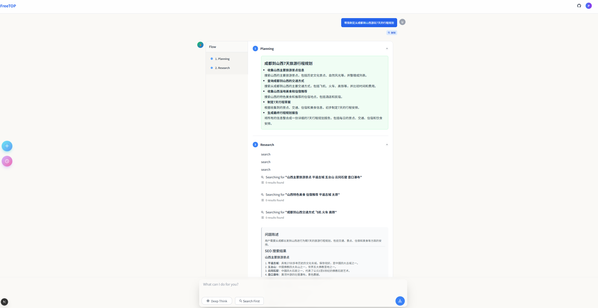

# 🦜🤖 FreeTop

[](https://www.python.org/downloads/)
[](https://opensource.org/licenses/MIT)

[English](./README.md) | [简体中文](./README_zh.md)

> Inspired by LangManus, Built for Freedom

**FreeTop** is a multi-agent AI automation framework built on [LangGraph](https://github.com/langchain-ai/langgraph), featuring a Next.js frontend with real-time streaming, conversation persistence via checkpointing, and parallel agent execution.



## Architecture

```
User → Coordinator → Planner → Supervisor → [Researcher / Coder / Browser / Reporter]
                                    ↑________________parallel merge_________________↓
```

- **Backend**: FastAPI + LangGraph (supervisor pattern, MemorySaver checkpointing, Send API for parallel tasks)
- **Frontend**: Next.js 15 + React 18 + Zustand (`subscribeWithSelector`) + SSE streaming
- **LLMs**: Three-tier system (reasoning / basic / vision) via [litellm](https://docs.litellm.ai/docs/providers)

## Quick Start

```bash
git clone https://github.com/Hedlen/freetop.git
cd freetop

# Install dependencies
uv sync
uv run playwright install

# Configure
cp .env.example .env        # add your API keys
cp conf.yaml.example conf.yaml

# Run backend
uv run server.py

# Run frontend (separate terminal)
cd web && pnpm install && pnpm dev
```

## Configuration

`conf.yaml` — LLM routing:

```yaml
USE_CONF: true

REASONING_MODEL:
  model: "volcengine/ep-xxxx"
  api_key: $REASONING_API_KEY

BASIC_MODEL:
  model: "azure/gpt-4o-2024-08-06"
  api_key: $AZURE_API_KEY

VISION_MODEL:
  model: "azure/gpt-4o-2024-08-06"
  api_key: $AZURE_API_KEY
```

`.env` — tool keys:

```ini
TAVILY_API_KEY=your_key
JINA_API_KEY=your_key        # optional
CHROME_HEADLESS=False
```

## API

`POST /api/chat/stream` — SSE streaming chat:

```json
{
  "messages": [{ "role": "user", "content": "your query" }],
  "thread_id": "optional-uuid",
  "deep_thinking_mode": false,
  "search_before_planning": false
}
```

`POST /api/chat/abort/{task_id}` — abort a running workflow.

## Docker

```bash
# Backend only
docker build -t freetop .
docker run -d --env-file .env -e CHROME_HEADLESS=True -p 8000:8000 freetop

# Full stack (backend + frontend)
docker-compose up -d
# backend → http://localhost:8000
# frontend → http://localhost:3000
```

## Testing

```bash
# Backend
pytest tests/unit tests/integration tests/property -q

# Frontend
cd web && pnpm test
```

Test layout:

| Path | Scope |
|------|-------|
| `tests/unit/` | supervisor routing, planner JSON, SSE injection |
| `tests/integration/` | `/api/chat/stream`, `/api/chat/abort` |
| `tests/property/` | Hypothesis property tests |
| `web/src/**/__tests__/` | Vitest component & store tests |

## Development

```bash
make lint      # ruff + eslint
make format    # black + prettier
make serve     # start API server
```

## Contributing

PRs and issues welcome. See [CONTRIBUTING.md](CONTRIBUTING.md).

## License

[MIT](LICENSE)

## Acknowledgments

Built on [LangManus](https://github.com/langmanus/langmanus), [LangGraph](https://github.com/langchain-ai/langgraph), [LangChain](https://github.com/langchain-ai/langchain), [browser-use](https://pypi.org/project/browser-use/), [Tavily](https://tavily.com/), and [Jina](https://jina.ai/).
